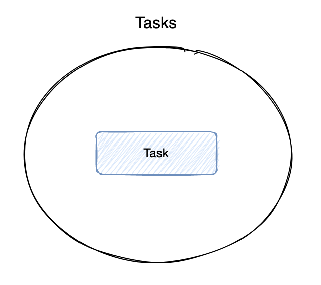
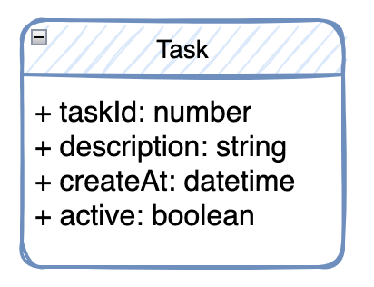
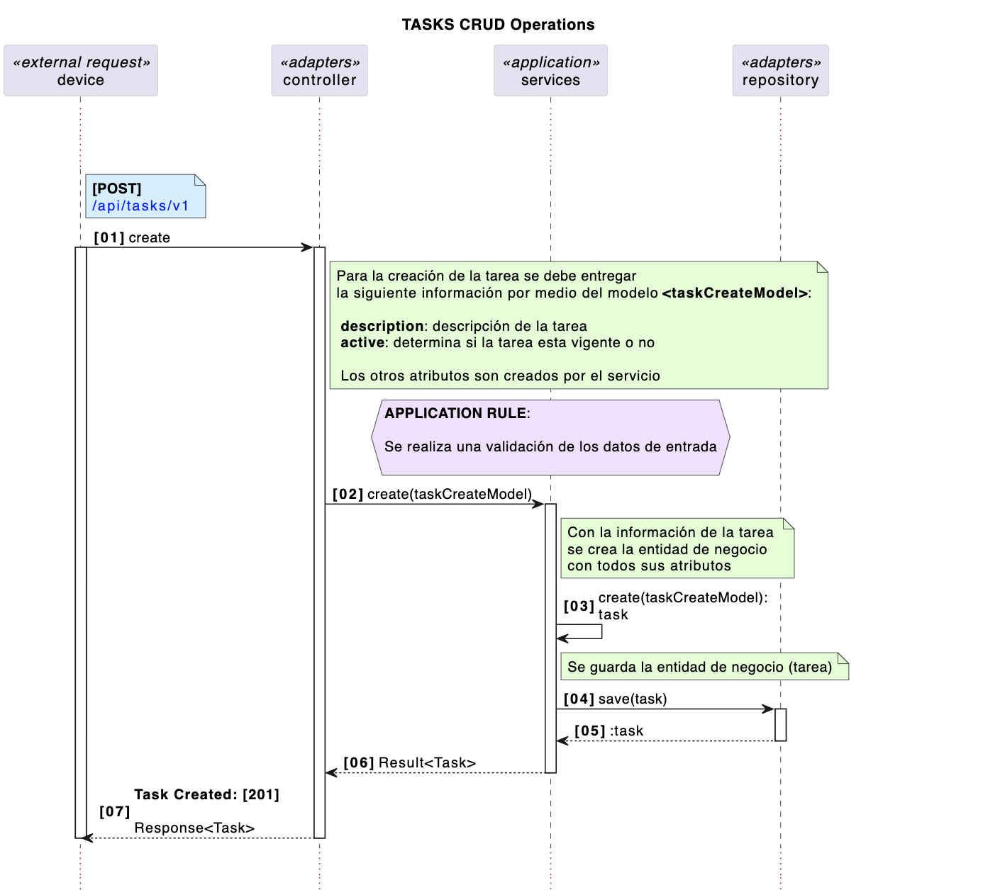
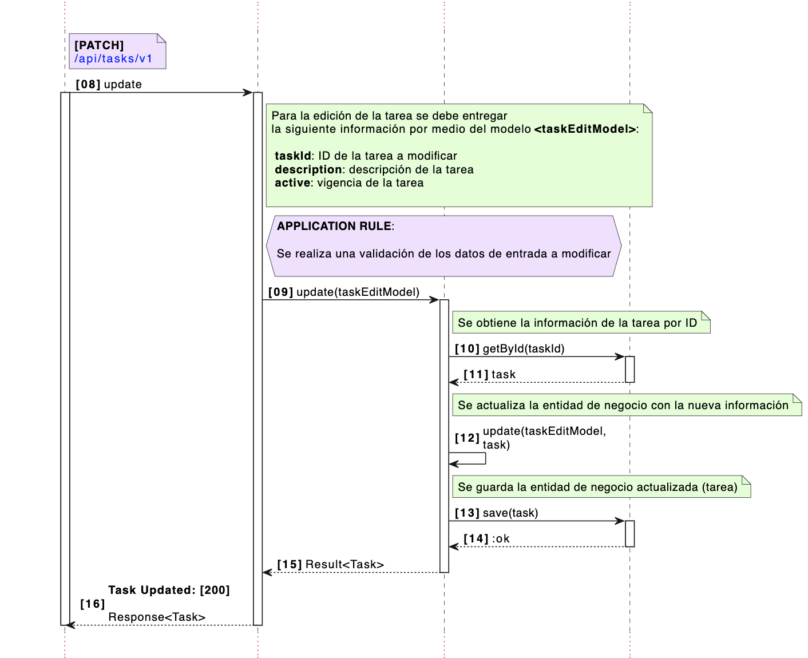
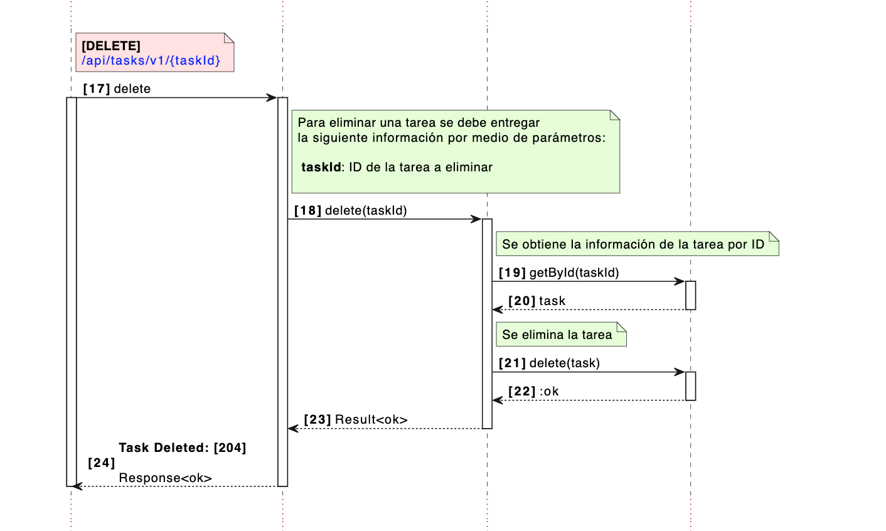
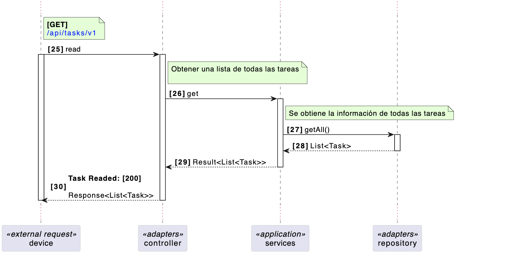
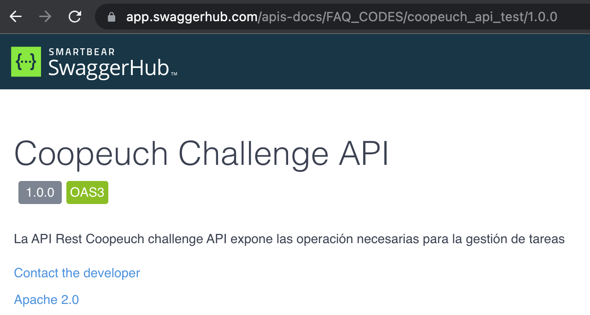
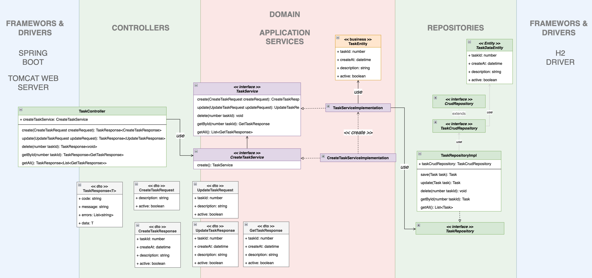

# Desafío coopeuch backend

A continuación se presenta la solución (diseño e implementación) del desafío Coopeuch correspondiente al backend.  El desafío consta de una parte en el frontend y una parte en el backend. El frontend se puede encontrar en el siguiente enlace [challenge-coopeuch-frontend](https://github.com/faqcodes/challenge-coopeuch-frontend). El enunciado del desafío se encuentra en este enlace [ENUNCIADO](docs/images/challenge.png)

## Diseño

Se trata de dar solución al problema con un enfoque de **"design-first"**. Para el diseño de la solución se comienza definiendo las entidades del dominio, encontrándose solo una: Tareas



Se establecen algunos atributos iniciales que puede tener la entidad de negocio Tarea, como se muestra en la siguiente imagen:



Según el enunciado se deben realizar operaciones CRUD sobre esta entidad y se deben exponer como API REST. También se deben realizar algunas validaciones en los datos de entrada, persistir los datos y realizar pruebas.

Con lo anterior se puede realizar un diagrama de secuencia que permita visualizar el flujo de estas operaciones dentro del sistema para su mejor entendimiento. A continuación, se muestra un diagrama de secuencia con las operaciones CRUD para la gestión de las tareas:






Una vez realizado el diagrama de secuencia se puede concluir que no existen lógica de negocio compleja sino que corresponde a un CRUD simple. Sin embargo, se debe validar la información de entrada y controlar posibles errores.

Con respecto a las entradas y salidas del sistema se busca alcanzar el máximo nivel de madurez para la API, es decir, utilizar los métodos y verbos HTTP para las distintas operaciones e incluir el principio HATEOS. También, se busca una salida consistente para ser tratada por el cliente de manera simple.

## OPEN API (Swagger)

Con lo anterior y considerando que solo existen operaciones CRUD para la gestión de tareas, es posible documentar la API.

En el siguiente [link](https://app.swaggerhub.com/apis-docs/FAQ_CODES/coopeuch_api_test/1.0.0) se encuentra la documentación.



Este es un intento previo para probar el funcionamiento y visualización de los objetos que la API retorna, sin encontrarse aún implementada.

En la implementación de la solución se utilizará las herramientas que provee Sprintboot para la documentación de la API a través de Swagger.


## DISEÑO DETALLADO

Con la información obtenida hasta ahora se puede realizar un diseño detallado de los objetos involucrados en la solución del problema. A continuación, se muestra un esquema de los objetos a crer y su interacción:




### La solcuión fue diseñada para que al crear una tarea, tanto el ID como la fecha de creación se crean en el backend. Por lo tanto, no es requerido que: taskID y createAt sean enviado por el cliente.


## Getting Started

Para la ejecución del proyecto se deben seguir los siguientes pasos.

Clonar el proyecto desde github
```
git clone git@github.com:faqcodes/challenge-coopeuch-backend.git

cd challenge-coopeuch-backend
```

Construir el proyecto
```
./gradlew build
```

Ejecutar el proyecto. Se ejecutar las pruebas de la solución y se desplegará en el puerto <b>8090<b>

```
./gradlew bootRun
```

El proyecto usa H2 en memoria como base de datos. Al ejecutar la aplicación, se insertarán 3 tareas por defecto. Al momento de detener la aplicación, toda la información se eliminará.

### La aplicación se ejecuta en el puerto <b>8090</b>. La aplicación cliente se encuentra configurada para que apunte a ese puerto

## cURL para interactuar con la API

Obtener todas las tareas: GET
```
curl --location 'http://localhost:8090/api/tasks/v1'
```

Obtener una tarea por ID: GET
```
curl --location 'http://localhost:8090/api/tasks/v1/84817039973'
```

Crear una tarea: POST
```
curl --location 'http://localhost:8090/api/tasks/v1' \
--header 'Content-Type: application/json' \
--data '{
    "description": "DESCRIPCION TAREA X",
    "active": "true"
}'
```

ERROR al crear una tarea (falta la descripcion)
```
curl --location 'http://localhost:8090/api/tasks/v1' \
--header 'Content-Type: application/json' \
--data '{
    "description": "",
    "active": "true"
}'
```

Actualizar una tarea: PATCH
```
curl --location --request PATCH 'http://localhost:8090/api/tasks/v1' \
--header 'Content-Type: application/json' \
--data '{
    "taskId": 1,
    "description": "TAREA ACTUALIZADA X",
    "active": "true"
}'
```

Eliminar una tarea: DELETE
```
curl --location --request DELETE 'http://localhost:8090/api/tasks/v1/1'
```

